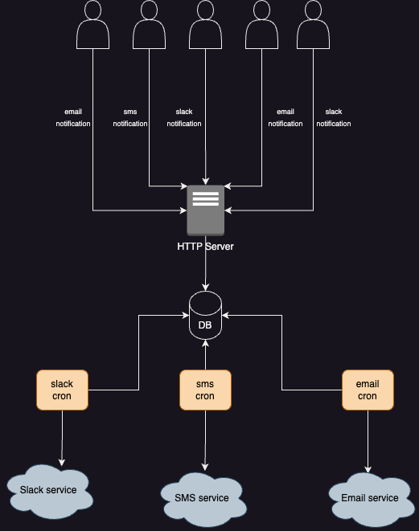

# Notifications service

### Architecture
The system contains 2 major branches - server and cron processor. HTTP server handles incoming notifications and store them inside a common table in DB. Cron processor runs asyncronously and notify third-party services (currently slack, sms and email).

##### Pros:
- notifications are stored in database after processed, so we can have history
- independent notifications processing
- scalability
- processor runs in batches
- could easily add another transport protocol like gRPC

##### Cons:
- system is dependant of database and its capabilities
- no order of delivered messages is guaranteed

### Improvements
- usage of message broker and using an outbox pattern
- integration tests could be structured a little better
- unit test are always welcome
- metrics, monitoring
- logging
- DI Container
- DB migrations for better handling DB schema changes
- Idempotency of incoming notifications can be implemented, so we avoid duplicates

### Endpoints and usage
Here are the exposed endpoints
```
POST   /slack
POST   /sms
POST   /email
```
An example request payload would be:
```
{
  "message": "a message",
  "receiver": "a receiver"
}
```
### Setup
Prerequisites:  ``docker`` & ``docker-compose``

1. Compile docker image by running
```bash
make build
```
3. Generate the .env file
```bash
make init
```
* populate .env third-party credentials with your own ones
2. Run the service
```bash
make up
```
3. Test the service
```bash
make test
```
4. Stop the service
```bash
make down
```

